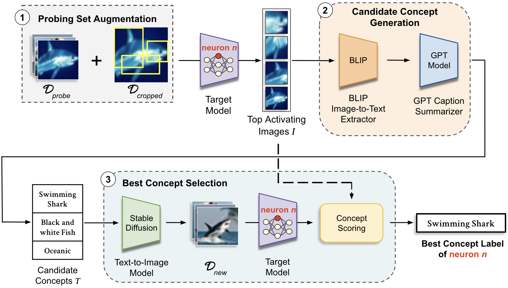
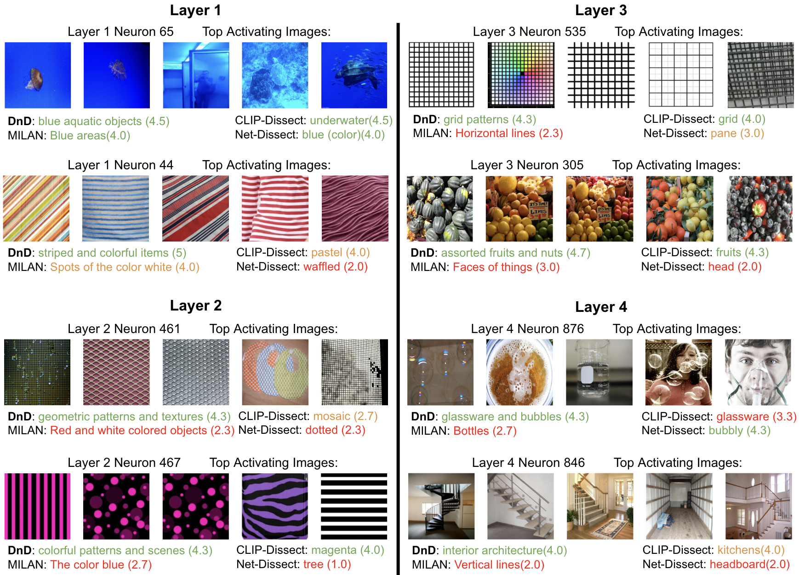

# Describe-and-Dissect (DnD)

**This is the official repository for our paper [Interpreting Neurons in Deep Vision Networks with Language Models](https://openreview.net/pdf?id=x1dXvvElVd), TMLR 2025.** For a quick read of our work, please see our [project website](https://lilywenglab.github.io/Describe-and-Dissect/): 
* DnD is a novel method to describe the roles of hidden neurons in vision networks with higher quality than existing neuron-level interpretability tools, establishing a new state-of-the-art. 
* DnD is **training-free**, **concept-set-free**, providing **generative natural language description**, and can easily leverage more capable general purpose models in the future.
* Below we illustrates the pipeline of DnD (*left*) and the results provided by DnD and other methods with scores (*right*)

<p align="center">
    
  &nbsp &nbsp &nbsp &nbsp &nbsp
  
</p>


## Installation

1. Install Python (3.11.5)
2. Install remaining requirements using `pip install -r requirements.txt`
3. Register an OpenAI API key at https://openai.com/blog/openai-api and replace all instances of `OPENAI_KEY` with your personal key.
4. Download the pre-trained BLIP model [here](https://storage.googleapis.com/sfr-vision-language-research/BLIP/models/model_base_capfilt_large.pth) and replace all instances of `BLIP_PATH` with the path to model.
5. Download the Broden dataset (images only) using `bash dlbroden.sh`
6. (Optional) Download ResNet-18 pretrained on Places-365: `bash dlzoo_example.sh`
7. Define the path to your datasets via `DATASET_ROOTS[<dataset_name>]` in `data_utils.py`.

NOTE: Extensive use of this model may require the purchase of an API Key once total usage exceeds $5.00.

We do not include instructions to download ImageNet data, you must specify the correct path to your copy of ImageNet dataset.

## Quickstart:
1. Define your OpenAI API Key `<OPENAI_KEY>` and path to pretrained BLIP `<BLIP_PATH>` in `describe_neurons.py`
2. Specify target neuron to dissect using `--ids_to_check <string of comma-separated ids, no spaces>` - Example: `'1,2,3'`
3. The code will dissect specified neurons in Layer 4 of ResNet-50 using ImageNet U Broden as the probing dataset.
```
python describe_neurons.py --ids_to_check <neuron_to_dissect>
```

## Modify DnD:
### A. Dissecting your model
1. Implement the code to load your model and preprocess in `data_utils.py` under the `get_target_model` function.
2. Dissect your model by running
```
python describe_neurons.py --ids_to_check <neuron_to_dissect> --target_model <model_name>
```

### B. Dissecting different layers
1. Specify the layer to dissect (e.g. 'layer4')
```
python describe_neurons.py --ids_to_check <neuron_to_dissect> --target_layer <target_layer>
```

### C. Using your own probing dataset
1. Implement the code to load your dataset in `data_utils.py` under the `get_data` function. You will need to include your own path to the dataset.
2. Add the name of your dataset to the choice of `--d_probe` under `describe_neurons.py`
3. Dissect your model by running
```
python describe_neurons.py --ids_to_check <neuron_to_dissect> --d_probe <dataset_name>
```

### D. Specifying a device
Specify the device used with `--device`, the default device is `cuda`.
```
python describe_neurons.py --ids_to_check <neuron_to_dissect> --device <device>
```

### E. Customizing save files
1. Results will be saved into `--results_dir <path_to_results_directory>`. If no argument is passed, results are saved into `./experiments/exp_results`.
2. Target model activations will be saved into `--saved_acts_dir <path_to_saved_activations_directory>`. If no argument is passed, activations are saved in `./experiments/saved_activations`.
3. You may also add `--tag <experiment_tag>` to differentiate between saved result files. 

## Reproducing Experiments:
The code for all experiments in our paper can be found under the `experiments` folder. Each notebook corresponds to the table or figure presented in the paper.

### A. Experiment Setup
1. Define your OpenAI API Key in `DnD_models.py` and path to pretrained BLIP when loading BLIP in the notebook.
2. Results will be saved into `./experiments/exp_results`

### B. Use Case Setup
1. Download the Tile2Vec Resnet-18 checkpoint [here](https://www.dropbox.com/s/bvzriiqlcof5lol/naip_trained.ckpt?dl=0) and save the file in `tile2vec-master/models/naip_trained.ckpt`
2. Unzip tiles.zip in `tile2vec-master/data/` and place in `tile2vec-master/data/tiles/`

## Clarifications:
Due to the generative nature of our model, separate executions may yield slightly varying neuron descriptions. Results from reproduced experiments may also differ marginally from those presented in the paper.

## Sources:
* CLIP-Dissect: https://github.com/Trustworthy-ML-Lab/CLIP-dissect
* CLIP: https://github.com/openai/CLIP
* BLIP: https://huggingface.co/Salesforce/blip-image-captioning-base
* GPT-3.5 Turbo: https://platform.openai.com/docs/models/gpt-3-5
* Stable Diffusion: https://huggingface.co/runwayml/stable-diffusion-v1-5
* Tile2Vec: https://github.com/ermongroup/tile2vec


## Cite this work
N. Bai*, R. Iyer*, T. Oikarinen, A. Kulkarni, and T.-W. Weng, [*Interpreting Neurons in Deep Vision Networks with Language Models*](https://openreview.net/pdf?id=x1dXvvElVd), TMLR 2025.

```
@article{
  bai2025interpreting,
  title={Interpreting Neurons in Deep Vision Networks with Language Models},
  author={Bai, Nicholas and Iyer, Rahul Ajay and Oikarinen, Tuomas and Kulkarni, Akshay R. and Weng, Tsui-Wei},
  journal={Transactions on Machine Learning Research},
  issn={2835-8856},
  year={2025},
  url={https://openreview.net/forum?id=x1dXvvElVd}
}
```

